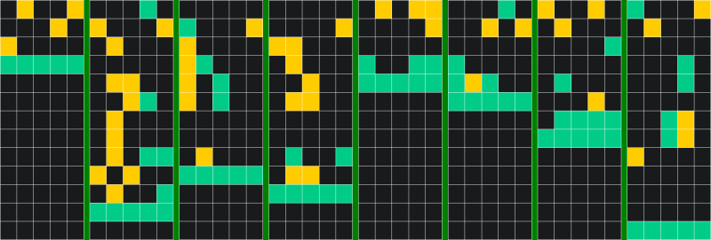
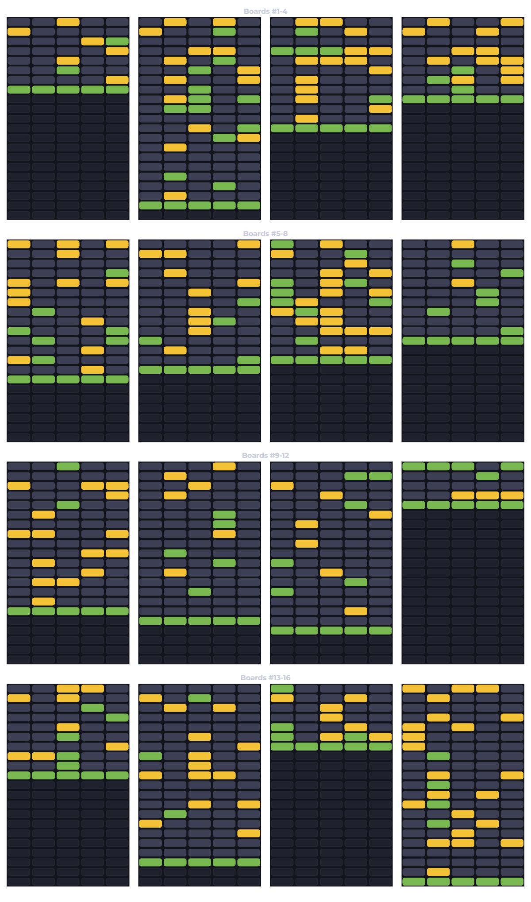
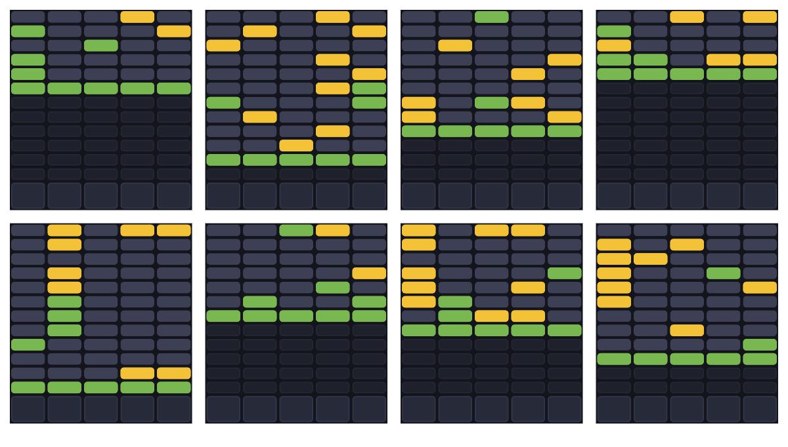
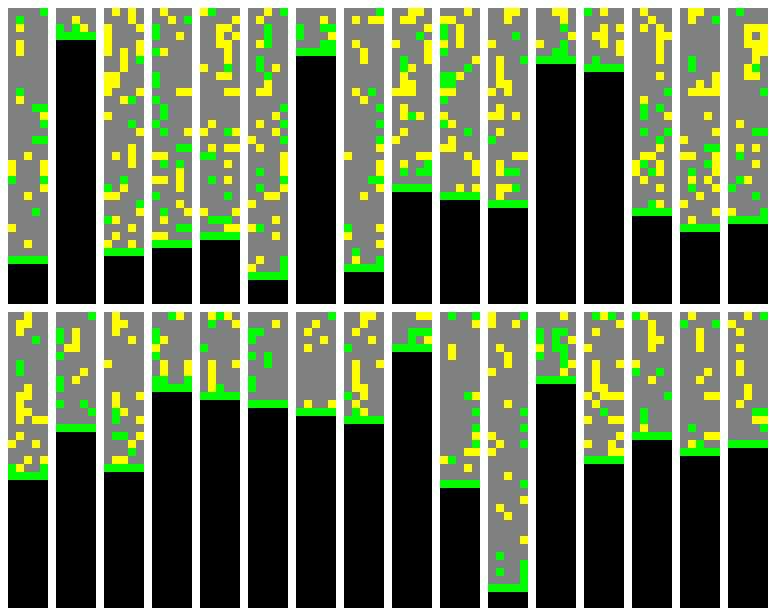
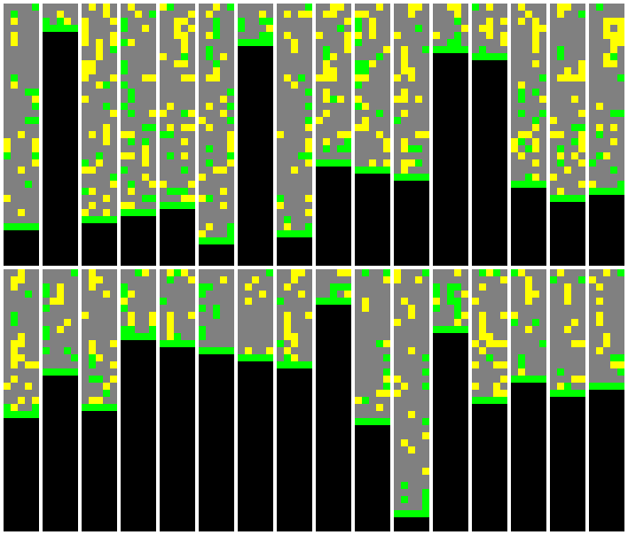
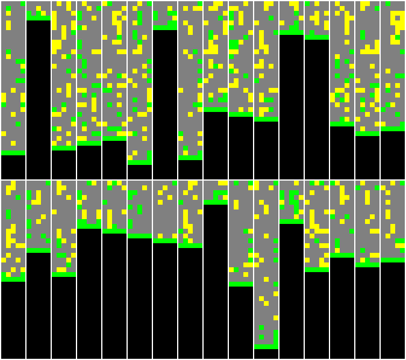
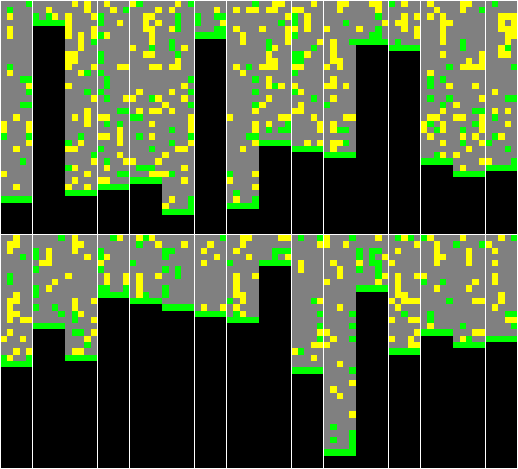

# octordle-results

Display results of octordle game graphically or in character-based mode

## Background

Those of you who enjoy playing [octordle](https://www.britannica.com/games/octordle/daily) (a variation of wordle that presents 8 wordle-like boards simultaneously with a maximum of 13 guesses permitted to solve all 8 boards) may be frustrated that the the "sharing" functions only displays the count of guesses for each board, but not the actual display of guesses as the other wordle variations display. Typically, the sharing functionality inserts something like the following into your clipboard:

<pre>
Daily Octordle #83
4️⃣🕛
🔟🕚
5️⃣6️⃣
8️⃣🕐
octordle.com
</pre>

However, what we might really want is something like the following (or perhaps some other layout like 1x8, 8x1, or 2x4):

<pre>
Board: 1    Board: 2
⬛🟨⬛⬛🟨 ⬛⬛⬛🟩⬛ 
⬛⬛⬛🟨⬛ 🟨⬛⬛⬛🟨 
🟨⬛⬛⬛⬛ ⬛🟨⬛⬛⬛ 
🟩🟩🟩🟩🟩 ⬛⬛⬛⬛⬛ 
⬛⬛⬛⬛⬛ ⬛🟨🟨⬛⬛ 
⬛⬛⬛⬛⬛ ⬛⬛🟨🟩⬛ 
⬛⬛⬛⬛⬛ ⬛🟨⬛⬛⬛ 
⬛⬛⬛⬛⬛ ⬛🟨⬛⬛⬛ 
⬛⬛⬛⬛⬛ ⬛🟨⬛🟩🟩 
⬛⬛⬛⬛⬛ 🟨⬛🟨⬛⬛ 
⬛⬛⬛⬛⬛ ⬛🟨⬛⬛🟩 
⬛⬛⬛⬛⬛ 🟩🟩🟩🟩🟩 
⬛⬛⬛⬛⬛ ⬛⬛⬛⬛⬛ 
Board: 3    Board: 4
⬛⬛⬛⬛⬛ ⬛⬛⬛⬛⬛ 
🟩⬛⬛⬛🟨 ⬛⬛⬛⬛🟨 
🟨⬛⬛⬛⬛ 🟨🟨⬛⬛⬛ 
🟨🟩⬛⬛⬛ ⬛🟨⬛⬛⬛ 
🟨⬛🟩⬛⬛ ⬛⬛🟨⬛⬛ 
🟨⬛🟩⬛⬛ ⬛🟨🟨⬛⬛ 
⬛⬛⬛⬛⬛ ⬛⬛⬛⬛⬛ 
⬛⬛⬛⬛⬛ ⬛⬛⬛⬛⬛ 
⬛🟨⬛⬛⬛ ⬛🟩⬛⬛🟩 
🟩🟩🟩🟩🟩 ⬛🟨🟨⬛⬛ 
⬛⬛⬛⬛⬛ 🟩🟩🟩🟩🟩 
⬛⬛⬛⬛⬛ ⬛⬛⬛⬛⬛ 
⬛⬛⬛⬛⬛ ⬛⬛⬛⬛⬛ 
Board: 5    Board: 6
⬛🟨⬛🟨🟨 ⬛⬛⬛🟩⬛ 
⬛⬛⬛⬛🟨 ⬛⬛🟨⬛🟨 
⬛⬛⬛⬛⬛ ⬛⬛⬛⬛⬛ 
🟩⬛⬛🟩🟩 🟩⬛⬛⬛⬛ 
🟩🟩🟩🟩🟩 🟩🟨🟩⬛⬛ 
⬛⬛⬛⬛⬛ 🟩🟩🟩🟩🟩 
⬛⬛⬛⬛⬛ ⬛⬛⬛⬛⬛ 
⬛⬛⬛⬛⬛ ⬛⬛⬛⬛⬛ 
⬛⬛⬛⬛⬛ ⬛⬛⬛⬛⬛ 
⬛⬛⬛⬛⬛ ⬛⬛⬛⬛⬛ 
⬛⬛⬛⬛⬛ ⬛⬛⬛⬛⬛ 
⬛⬛⬛⬛⬛ ⬛⬛⬛⬛⬛ 
⬛⬛⬛⬛⬛ ⬛⬛⬛⬛⬛ 
Board: 7    Board: 8
🟨⬛⬛🟨⬛ 🟩⬛⬛⬛🟨 
⬛🟨⬛⬛⬛ ⬛🟨⬛⬛⬛ 
⬛⬛⬛⬛🟩 ⬛⬛⬛⬛⬛ 
⬛⬛⬛⬛⬛ ⬛⬛⬛🟩⬛ 
⬛🟩⬛⬛⬛ ⬛⬛⬛🟩⬛ 
⬛⬛⬛🟨⬛ ⬛⬛⬛⬛⬛ 
⬛🟩🟩🟩🟩 ⬛⬛🟩🟨⬛ 
🟩🟩🟩🟩🟩 ⬛⬛🟩🟨⬛ 
⬛⬛⬛⬛⬛ 🟨⬛⬛⬛⬛ 
⬛⬛⬛⬛⬛ ⬛⬛⬛⬛⬛ 
⬛⬛⬛⬛⬛ ⬛⬛⬛⬛⬛ 
⬛⬛⬛⬛⬛ ⬛⬛⬛⬛⬛ 
⬛⬛⬛⬛⬛ 🟩🟩🟩🟩🟩 
</pre>

With a little bit of code, we can address that issue. In all cases we simply need to display the browser's debugger window using Ctrl Shift J (on Windows) or Ctrl Option J (on Mac).

## Graphical Approach

This is the easiest, but will probably require you to use some screen capture tool after performing this operation.

```js
document.querySelectorAll('div[class="letter-content"]').forEach(function (x) {
  x.innerText = "";
});
```

This has the effect of removing the text from each cell, but leaving the color behind so that you can take a screenshot and share the image without revealing your actual guesses. The resulting image after screen capture might look something like (I prefer to play octordle in widescreen mode so the screen capture reflects this layout):



## Character-based approaches

You may want or need to display your guesses in character form rather than in image form. There are several ways you can do this.

## Game boards arranged 2 columns x 4 rows

The following code, when executed in the debugger window you have opened already, will produce a a result consisting of two columns with boards 1, 2 displayed stacked above boards 3, 4 and those consequently above boards 5, 6, and finally boards 7, 8. Make sure you have refreshed the browser to restore the text, if you ran the code in the "Graphical Approach".

**Important** Any layout that has multiple columns may require adjustment to the code below to get the columns to display in an aligned manner. For example, Facebook converts tab characters to spaces, so the tab character `\t` does not align text, but instead just adds one space. Furthermore, converting a tab into multiple consecutive spaces does not work because browsers collapse consecutive spaces into one space when viewing HTML. Facebook does not allow you to use (or at least use well) the non-breaking space character so the least instrusive character that is printable is probably the period.

```js
nbsp = " ".repeat(5);
// For Facebook, use nbsp = (".".repeat(14))
nbsp = ".".repeat(14);
dictGuessToSymbol = {
  "no-match": "⬜",
  "word-match": "🟨",
  "exact-match": "🟩",
  "no-guess": "⬛",
};
results = "\n";
for (i = 1; i < 5; i++) {
  for (board = 1; board < 3; board++) {
    results += "Board: " + (board + 2 * (i - 1)) + (board < 2 ? nbsp : "");
  }
  correct_guess = [false, false];
  for (row = 1; row < 14; row++) {
    rowSymbols = "\n";
    for (board = 1; board < 3; board++) {
      if (correct_guess[board - 1]) {
        rowSymbols += dictGuessToSymbol["no-guess"].repeat(5) + " ";
      } else if (
        document
          .getElementById("board-" + (2 * (i - 1) + (board < 2 ? 1 : 2)))
          .getElementsByClassName("board-row")
          [row - 1].getElementsByClassName("letter exact-match").length > 4
      ) {
        correct_guess[board - 1] = true;
        rowSymbols += dictGuessToSymbol["exact-match"].repeat(5) + " ";
      } else {
        for (col = 1; col < 6; col++) {
          if (
            document
              .getElementById("board-" + (2 * (i - 1) + (board < 2 ? 1 : 2)))
              .getElementsByClassName("board-row")
              [row - 1].getElementsByClassName("letter")
              [col - 1].classList.contains("exact-match")
          )
            rowSymbols += dictGuessToSymbol["exact-match"];
          else if (
            document
              .getElementById("board-" + (2 * (i - 1) + (board < 2 ? 1 : 2)))
              .getElementsByClassName("board-row")
              [row - 1].getElementsByClassName("letter")
              [col - 1].classList.contains("word-match")
          )
            rowSymbols += dictGuessToSymbol["word-match"];
          else rowSymbols += dictGuessToSymbol["no-match"];
        }
        rowSymbols += " ";
      }
    }
    results += rowSymbols;
  }
  results += "\n";
}
console.log(results);
```

This produces a result similar to this:

<pre>
Board: 1.....Board: 2
🟩⬜🟨🟩🟨 ⬜🟨⬜⬜🟨 
🟨⬜⬜⬜⬜ 🟩⬜⬜🟩⬜ 
⬜⬜⬜⬜⬜ ⬜⬜⬜⬜⬜ 
⬜🟨⬜⬜🟩 🟨⬜⬜⬜⬜ 
⬜⬜⬜⬜⬜ ⬜⬜⬜⬜⬜ 
⬜⬜⬜🟨⬜ 🟨⬜⬜⬜🟨 
🟩⬜🟩⬜⬜ ⬜🟨🟨⬜⬜ 
🟩🟩🟩🟩🟩 ⬜🟩🟨⬜⬜ 
⬛⬛⬛⬛⬛ 🟩🟩🟩🟩🟩 
⬛⬛⬛⬛⬛ ⬛⬛⬛⬛⬛ 
⬛⬛⬛⬛⬛ ⬛⬛⬛⬛⬛ 
⬛⬛⬛⬛⬛ ⬛⬛⬛⬛⬛ 
⬛⬛⬛⬛⬛ ⬛⬛⬛⬛⬛ 
Board: 3.....Board: 4
⬜⬜⬜🟩⬜ 🟩🟩⬜⬜⬜ 
🟩⬜🟨⬜⬜ 🟨⬜⬜⬜⬜ 
⬜⬜⬜⬜⬜ 🟨⬜⬜⬜⬜ 
⬜🟨⬜⬜⬜ 🟨⬜⬜⬜⬜ 
⬜⬜⬜⬜⬜ 🟨⬜⬜⬜⬜ 
⬜⬜⬜⬜⬜ ⬜⬜⬜⬜🟨 
⬜⬜🟩⬜⬜ 🟩🟩🟩🟩🟩 
⬜⬜🟩🟩⬜ ⬛⬛⬛⬛⬛ 
🟩⬜⬜⬜⬜ ⬛⬛⬛⬛⬛ 
🟩🟩🟩🟩🟩 ⬛⬛⬛⬛⬛ 
⬛⬛⬛⬛⬛ ⬛⬛⬛⬛⬛ 
⬛⬛⬛⬛⬛ ⬛⬛⬛⬛⬛ 
⬛⬛⬛⬛⬛ ⬛⬛⬛⬛⬛ 
Board: 5.....Board: 6
⬜🟨⬜⬜⬜ ⬜🟨🟨⬜⬜ 
🟨⬜⬜⬜⬜ ⬜⬜⬜⬜🟨 
⬜🟨⬜⬜⬜ ⬜⬜🟩⬜⬜ 
🟨⬜⬜⬜⬜ 🟨⬜🟨⬜🟨 
⬜⬜⬜⬜🟩 ⬜🟩⬜⬜⬜ 
⬜⬜⬜⬜🟨 🟩🟩🟩🟩🟩 
⬜🟨🟨⬜⬜ ⬛⬛⬛⬛⬛ 
⬜⬜🟨⬜⬜ ⬛⬛⬛⬛⬛ 
🟨⬜🟩⬜⬜ ⬛⬛⬛⬛⬛ 
🟨⬜⬜⬜⬜ ⬛⬛⬛⬛⬛ 
⬜🟩🟩🟩🟩 ⬛⬛⬛⬛⬛ 
🟩🟩🟩🟩🟩 ⬛⬛⬛⬛⬛ 
⬛⬛⬛⬛⬛ ⬛⬛⬛⬛⬛ 
Board: 7.....Board: 8
⬜⬜⬜⬜⬜ ⬜🟨🟨🟨⬜ 
⬜⬜⬜⬜🟨 ⬜⬜⬜⬜🟨 
🟩🟨⬜🟩⬜ ⬜⬜⬜🟩⬜ 
⬜⬜🟩🟩⬜ 🟩🟩🟩🟩🟩 
🟩🟩🟩🟩🟩 ⬛⬛⬛⬛⬛ 
⬛⬛⬛⬛⬛ ⬛⬛⬛⬛⬛ 
⬛⬛⬛⬛⬛ ⬛⬛⬛⬛⬛ 
⬛⬛⬛⬛⬛ ⬛⬛⬛⬛⬛ 
⬛⬛⬛⬛⬛ ⬛⬛⬛⬛⬛ 
⬛⬛⬛⬛⬛ ⬛⬛⬛⬛⬛ 
⬛⬛⬛⬛⬛ ⬛⬛⬛⬛⬛ 
⬛⬛⬛⬛⬛ ⬛⬛⬛⬛⬛ 
⬛⬛⬛⬛⬛ ⬛⬛⬛⬛⬛ 
</pre>

# sedecordle-results

Similar to the solution for the octordle game above, we can extend something similar to the [sedecordle game](https://sedecordlegame.org/)

The results are normally displayed in a simple grid, something like:

<pre>
I solved this Sedecordle in 21/21 tries. Can you guess these 16 words? 

🟩🟩🟩🟩
🟩🟩🟩🟩
🟩🟩🟩🟩
🟩🟩🟩🟩

https://sedecordlegame.org?challenge=cGVhY2gsdHJhaXQscXVpZXQsZ2lhbnQsZGVuc2UsZmF1bmEsc2VwaWEsZmVtbWUsd2hlbHAsY3J1bWIsZm9saW8sc3RlaW4sZHJhcGUscGFkZHksc2lnbWEscmVidXM6ZW4
</pre>

But this obviously only show which of the 16 boards you managed to complete within the 21 tries allowed.

## Graphical Approach

Again, the easy approach is to blank out the guesses and then download the PNG image for your guesses

```js
document.querySelectorAll('div[class*="Row-letter"]').forEach(function (x) {
  x.innerText = "";
});
```

Then use the modal window that is presented on completion of the puzzle to download an image of your guesses, like the following:



If the modal window has disappeared from view, simply execute the following in your debugger window:

```js
document.getElementsByClassName("modal_finish poof")[0].classList.add('active');
```

## Character-based Approach

```js
nbsp = " ".repeat(5);
// For Facebook, use nbsp = (".".repeat(14))
nbsp = ".".repeat(14);
dictGuessToSymbol = {
  "no-match": "⬜",
  "word-match": "🟨",
  "exact-match": "🟩",
  "no-guess": "⬛",
};
results = "";
for (i = 0; i < 8; i++) {
	for (board = 0; board < 2; board++) {
		results += "Board: " + (board + 1 + (2 * (i))) + (board < 1 ? nbsp : "")
	}
	for (row = 0; row < 21; row++) {
		rowSymbols = "\n"
		for (board = 0; board < 2; board++) {
			if (document.getElementsByClassName("game_rows")[board + (2 * (i))].getElementsByClassName("Row")[row].classList.contains("Row-not-using")) {
				rowSymbols += (dictGuessToSymbol["no-guess"]).repeat(5) + " "
			} else {
				for (col = 0; col < 5; col++) {
					letr = document.getElementsByClassName("game_rows")[board + (2 * (i))].getElementsByClassName("Row")[row].getElementsByClassName("Row-letter")[col]
					if (letr.classList.contains("letter-absent")) {
						rowSymbols += dictGuessToSymbol["no-match"]
					} else if (letr.classList.contains("letter-elsewhere")) {
						rowSymbols += dictGuessToSymbol["word-match"]
					} else {
						rowSymbols += dictGuessToSymbol["exact-match"]
					}
				}
				rowSymbols += " "
			}
		}
		results += rowSymbols
	}
	results += "\n"
}
console.log(results)
```

For the above game, this produces the following output in the console:

<pre>
Board: 1......Board: 2
⬜⬜🟨⬜⬜ ⬜🟨⬜🟨⬜ 
🟨⬜⬜⬜⬜ 🟨⬜⬜🟩⬜ 
⬜⬜⬜🟨🟩 ⬜⬜⬜⬜⬜ 
⬜⬜⬜⬜🟨 ⬜⬜🟨🟨⬜ 
⬜⬜🟨⬜⬜ ⬜🟨⬜🟩⬜ 
⬜⬜🟩⬜⬜ ⬜⬜🟩⬜🟨 
⬜⬜⬜⬜🟨 ⬜🟨⬜⬜🟨 
🟩🟩🟩🟩🟩 ⬜⬜🟩⬜⬜ 
⬛⬛⬛⬛⬛ ⬜🟨🟩⬜🟩 
⬛⬛⬛⬛⬛ ⬜🟩🟩⬜⬜ 
⬛⬛⬛⬛⬛ ⬜⬜⬜⬜⬜ 
⬛⬛⬛⬛⬛ ⬜⬜🟨⬜🟩 
⬛⬛⬛⬛⬛ ⬜⬜⬜🟩🟨 
⬛⬛⬛⬛⬛ ⬜🟨⬜⬜⬜ 
⬛⬛⬛⬛⬛ ⬜⬜⬜⬜⬜ 
⬛⬛⬛⬛⬛ ⬜⬜⬜⬜⬜ 
⬛⬛⬛⬛⬛ ⬜🟩⬜⬜⬜ 
⬛⬛⬛⬛⬛ ⬜⬜⬜🟩⬜ 
⬛⬛⬛⬛⬛ ⬜🟨⬜⬜⬜ 
⬛⬛⬛⬛⬛ 🟩🟩🟩🟩🟩 
⬛⬛⬛⬛⬛ ⬛⬛⬛⬛⬛ 
Board: 3......Board: 4
⬜🟨🟨⬜⬜ ⬜🟨⬜⬜🟨 
⬜🟩⬜🟨⬜ 🟨⬜⬜🟨⬜ 
⬜⬜⬜⬜⬜ ⬜⬜⬜⬜⬜ 
🟩🟩🟩🟨🟨 ⬜⬜🟨🟨⬜ 
⬜🟨🟨🟨⬜ ⬜🟨⬜🟨🟨 
⬜⬜⬜⬜🟨 ⬜⬜🟩⬜🟨 
⬜🟨⬜⬜⬜ ⬜🟩🟨⬜🟨 
⬜🟨⬜⬜⬜ ⬜⬜🟩⬜⬜ 
⬜🟨⬜⬜🟩 🟩🟩🟩🟩🟩 
⬜⬜⬜⬜🟨 ⬛⬛⬛⬛⬛ 
⬜🟨⬜⬜⬜ ⬛⬛⬛⬛⬛ 
🟩🟩🟩🟩🟩 ⬛⬛⬛⬛⬛ 
⬛⬛⬛⬛⬛ ⬛⬛⬛⬛⬛ 
⬛⬛⬛⬛⬛ ⬛⬛⬛⬛⬛ 
⬛⬛⬛⬛⬛ ⬛⬛⬛⬛⬛ 
⬛⬛⬛⬛⬛ ⬛⬛⬛⬛⬛ 
⬛⬛⬛⬛⬛ ⬛⬛⬛⬛⬛ 
⬛⬛⬛⬛⬛ ⬛⬛⬛⬛⬛ 
⬛⬛⬛⬛⬛ ⬛⬛⬛⬛⬛ 
⬛⬛⬛⬛⬛ ⬛⬛⬛⬛⬛ 
⬛⬛⬛⬛⬛ ⬛⬛⬛⬛⬛ 
Board: 5......Board: 6
🟨⬜🟨⬜🟨 ⬜⬜⬜⬜🟨 
⬜⬜🟨⬜⬜ 🟨🟨⬜⬜⬜ 
⬜⬜⬜⬜⬜ ⬜⬜⬜⬜⬜ 
⬜⬜⬜⬜🟩 ⬜🟨⬜⬜⬜ 
🟨⬜🟨⬜🟨 ⬜⬜⬜⬜🟨 
🟨⬜⬜⬜⬜ ⬜⬜🟨⬜⬜ 
🟨⬜⬜⬜⬜ ⬜⬜⬜⬜🟩 
⬜🟩⬜⬜⬜ ⬜⬜🟨⬜⬜ 
⬜⬜⬜🟨⬜ ⬜⬜🟨🟩⬜ 
🟩⬜⬜⬜🟩 ⬜⬜🟨⬜⬜ 
⬜🟩⬜⬜🟩 🟩⬜⬜⬜⬜ 
⬜⬜⬜🟨⬜ ⬜🟨⬜⬜⬜ 
🟨🟩⬜⬜⬜ ⬜⬜⬜⬜🟩 
⬜⬜⬜🟨⬜ 🟩🟩🟩🟩🟩 
🟩🟩🟩🟩🟩 ⬛⬛⬛⬛⬛ 
⬛⬛⬛⬛⬛ ⬛⬛⬛⬛⬛ 
⬛⬛⬛⬛⬛ ⬛⬛⬛⬛⬛ 
⬛⬛⬛⬛⬛ ⬛⬛⬛⬛⬛ 
⬛⬛⬛⬛⬛ ⬛⬛⬛⬛⬛ 
⬛⬛⬛⬛⬛ ⬛⬛⬛⬛⬛ 
⬛⬛⬛⬛⬛ ⬛⬛⬛⬛⬛ 
Board: 7......Board: 8
🟩⬜🟨⬜⬜ ⬜⬜🟨⬜⬜ 
🟨⬜⬜🟩⬜ ⬜⬜⬜⬜⬜ 
⬜⬜⬜🟨⬜ ⬜⬜🟩⬜⬜ 
⬜⬜🟨⬜🟨 ⬜⬜⬜⬜🟩 
🟩⬜🟨🟩⬜ ⬜⬜🟨⬜⬜ 
🟩⬜🟨⬜🟨 ⬜⬜⬜🟩⬜ 
🟩🟨⬜⬜🟩 ⬜⬜⬜🟩⬜ 
🟨🟩🟨⬜⬜ ⬜🟩⬜⬜⬜ 
⬜🟨🟨⬜⬜ ⬜⬜⬜⬜⬜ 
⬜⬜🟨🟨🟨 ⬜⬜⬜⬜🟩 
⬜🟩⬜⬜⬜ 🟩🟩🟩🟩🟩 
⬜⬜🟨🟨⬜ ⬛⬛⬛⬛⬛ 
🟩🟩🟩🟩🟩 ⬛⬛⬛⬛⬛ 
⬛⬛⬛⬛⬛ ⬛⬛⬛⬛⬛ 
⬛⬛⬛⬛⬛ ⬛⬛⬛⬛⬛ 
⬛⬛⬛⬛⬛ ⬛⬛⬛⬛⬛ 
⬛⬛⬛⬛⬛ ⬛⬛⬛⬛⬛ 
⬛⬛⬛⬛⬛ ⬛⬛⬛⬛⬛ 
⬛⬛⬛⬛⬛ ⬛⬛⬛⬛⬛ 
⬛⬛⬛⬛⬛ ⬛⬛⬛⬛⬛ 
⬛⬛⬛⬛⬛ ⬛⬛⬛⬛⬛ 
Board: 9......Board: 10
⬜⬜🟩⬜⬜ ⬜⬜⬜🟨⬜ 
⬜⬜⬜⬜⬜ ⬜🟨⬜⬜⬜ 
🟨⬜⬜🟨🟨 ⬜⬜🟨⬜⬜ 
⬜⬜⬜⬜🟨 ⬜🟨⬜⬜⬜ 
⬜⬜🟩⬜⬜ ⬜⬜⬜⬜⬜ 
⬜🟨⬜⬜⬜ ⬜⬜⬜🟩⬜ 
⬜⬜⬜⬜⬜ ⬜⬜⬜🟩⬜ 
🟨🟨⬜⬜🟨 ⬜⬜⬜🟨⬜ 
⬜⬜⬜⬜⬜ ⬜⬜⬜⬜⬜ 
⬜⬜⬜🟨🟨 ⬜🟩⬜⬜⬜ 
⬜🟨⬜⬜⬜ ⬜⬜⬜🟩⬜ 
⬜⬜⬜🟨⬜ ⬜🟨⬜⬜⬜ 
⬜🟨🟨⬜⬜ ⬜⬜⬜⬜⬜ 
⬜⬜⬜⬜⬜ ⬜⬜🟩⬜⬜ 
⬜🟨⬜⬜⬜ ⬜⬜⬜⬜⬜ 
🟩🟩🟩🟩🟩 ⬜⬜⬜⬜⬜ 
⬛⬛⬛⬛⬛ 🟩🟩🟩🟩🟩 
⬛⬛⬛⬛⬛ ⬛⬛⬛⬛⬛ 
⬛⬛⬛⬛⬛ ⬛⬛⬛⬛⬛ 
⬛⬛⬛⬛⬛ ⬛⬛⬛⬛⬛ 
⬛⬛⬛⬛⬛ ⬛⬛⬛⬛⬛ 
Board: 11.....Board: 12
⬜⬜⬜⬜⬜ 🟩🟩🟩⬜🟩 
⬜⬜⬜🟩🟩 ⬜⬜⬜🟩⬜ 
🟨⬜⬜⬜⬜ ⬜⬜⬜⬜⬜ 
⬜⬜🟨⬜⬜ ⬜⬜🟨🟨🟨 
⬜⬜⬜🟩⬜ 🟩🟩🟩🟩🟩 
⬜⬜⬜⬜🟨 ⬛⬛⬛⬛⬛ 
⬜🟨⬜⬜⬜ ⬛⬛⬛⬛⬛ 
⬜⬜⬜⬜⬜ ⬛⬛⬛⬛⬛ 
⬜🟨⬜⬜⬜ ⬛⬛⬛⬛⬛ 
⬜⬜⬜⬜⬜ ⬛⬛⬛⬛⬛ 
🟩⬜⬜⬜⬜ ⬛⬛⬛⬛⬛ 
⬜⬜🟨⬜⬜ ⬛⬛⬛⬛⬛ 
⬜⬜⬜🟩⬜ ⬛⬛⬛⬛⬛ 
🟩⬜⬜⬜⬜ ⬛⬛⬛⬛⬛ 
⬜⬜⬜⬜⬜ ⬛⬛⬛⬛⬛ 
⬜⬜⬜🟨⬜ ⬛⬛⬛⬛⬛ 
⬜⬜⬜⬜⬜ ⬛⬛⬛⬛⬛ 
🟩🟩🟩🟩🟩 ⬛⬛⬛⬛⬛ 
⬛⬛⬛⬛⬛ ⬛⬛⬛⬛⬛ 
⬛⬛⬛⬛⬛ ⬛⬛⬛⬛⬛ 
⬛⬛⬛⬛⬛ ⬛⬛⬛⬛⬛ 
Board: 13.....Board: 14
⬜⬜🟨🟨⬜ ⬜⬜⬜⬜⬜ 
🟨⬜🟨⬜⬜ 🟨⬜🟩⬜⬜ 
⬜⬜⬜🟩⬜ ⬜🟨⬜🟨⬜ 
⬜⬜⬜⬜🟩 ⬜⬜⬜⬜⬜ 
⬜⬜🟨⬜⬜ ⬜⬜⬜⬜⬜ 
⬜⬜🟩⬜⬜ ⬜⬜🟨⬜⬜ 
⬜⬜⬜⬜🟨 ⬜⬜⬜⬜🟨 
🟨🟨🟩⬜⬜ 🟩⬜🟨⬜⬜ 
⬜⬜🟩⬜⬜ ⬜⬜🟨⬜⬜ 
🟩🟩🟩🟩🟩 🟨⬜🟨🟨⬜ 
⬛⬛⬛⬛⬛ ⬜⬜⬜⬜⬜ 
⬛⬛⬛⬛⬛ ⬜⬜⬜⬜⬜ 
⬛⬛⬛⬛⬛ ⬜⬜🟨⬜🟨 
⬛⬛⬛⬛⬛ ⬜🟩⬜⬜⬜ 
⬛⬛⬛⬛⬛ 🟨⬜⬜⬜⬜ 
⬛⬛⬛⬛⬛ ⬜⬜⬜⬜🟨 
⬛⬛⬛⬛⬛ ⬜⬜⬜⬜⬜ 
⬛⬛⬛⬛⬛ ⬜⬜⬜⬜⬜ 
⬛⬛⬛⬛⬛ 🟩🟩🟩🟩🟩 
⬛⬛⬛⬛⬛ ⬛⬛⬛⬛⬛ 
⬛⬛⬛⬛⬛ ⬛⬛⬛⬛⬛ 
Board: 15.....Board: 16
🟩⬜⬜⬜⬜ 🟨⬜🟨🟨⬜ 
🟨⬜⬜🟨⬜ ⬜🟨⬜⬜⬜ 
⬜⬜🟨⬜⬜ ⬜⬜⬜⬜⬜ 
⬜⬜🟨⬜⬜ ⬜🟨⬜⬜🟨 
🟩⬜⬜🟨⬜ 🟨⬜🟨⬜⬜ 
🟩⬜🟨🟩🟨 🟨⬜⬜⬜⬜ 
🟩🟩🟩🟩🟩 🟨⬜⬜⬜⬜ 
⬛⬛⬛⬛⬛ ⬜🟩⬜⬜⬜ 
⬛⬛⬛⬛⬛ ⬜⬜⬜⬜⬜ 
⬛⬛⬛⬛⬛ ⬜🟨⬜⬜🟨 
⬛⬛⬛⬛⬛ ⬜🟩⬜⬜⬜ 
⬛⬛⬛⬛⬛ ⬜🟨⬜🟨⬜ 
⬛⬛⬛⬛⬛ 🟨🟩⬜⬜⬜ 
⬛⬛⬛⬛⬛ ⬜⬜🟨⬜⬜ 
⬛⬛⬛⬛⬛ ⬜🟩⬜🟨⬜ 
⬛⬛⬛⬛⬛ ⬜⬜🟨⬜⬜ 
⬛⬛⬛⬛⬛ ⬜🟨🟨⬜🟨 
⬛⬛⬛⬛⬛ ⬜⬜⬜⬜⬜ 
⬛⬛⬛⬛⬛ ⬜⬜⬜⬜⬜ 
⬛⬛⬛⬛⬛ ⬜🟨⬜⬜⬜ 
⬛⬛⬛⬛⬛ 🟩🟩🟩🟩🟩 
</pre>

# octordlewordle-results

Brought to you by the same people who provide sedecordle above, this game called [octordlewordle](https://octordlewordle.org/) also known as octordly is similar to octordle and uses just some minor tweaking of the code for sedecordle

## Graphical Approach

Again, the easy approach is to blank out the guesses and then download the PNG image for your guesses

```js
document.querySelectorAll('div[class*="Row-letter"]').forEach(function (x) {
  x.innerText = "";
});
```

Then use the modal window that is presented on completion of the puzzle to download an image of your guesses, like the following:



If the modal window has disappeared from view, simply execute the following in your debugger window:

```js
document.getElementsByClassName("modal_finish poof")[0].classList.add('active');
```

## Character-based Approach

```js
nbsp = " ".repeat(5);
// For Facebook, use nbsp = (".".repeat(14))
nbsp = (".".repeat(14))
dictGuessToSymbol = {
  "no-match": "⬜",
  "word-match": "🟨",
  "exact-match": "🟩",
  "no-guess": "⬛",
};
results = ""
for (i = 0; i < 4; i++) {
	for (board = 0; board < 2; board++) {
		results += "Board: " + (board + 1 + (2 * (i))) + (board < 1 ? nbsp : "")
	}
	for (row = 0; row < 13; row++) {
		rowSymbols = "\n"
		for (board = 0; board < 2; board++) {
			if (document.getElementsByClassName("game_rows")[board + (2 * (i))].getElementsByClassName("Row")[row].classList.contains("Row-not-using")) {
				rowSymbols += (dictGuessToSymbol["no-guess"]).repeat(5) + " "
			} else {
				for (col = 0; col < 5; col++) {
					letr = document.getElementsByClassName("game_rows")[board + (2 * (i))].getElementsByClassName("Row")[row].getElementsByClassName("Row-letter")[col]
					if (letr.classList.contains("letter-absent")) {
						rowSymbols += dictGuessToSymbol["no-match"]
					} else if (letr.classList.contains("letter-elsewhere")) {
						rowSymbols += dictGuessToSymbol["word-match"]
					} else {
						rowSymbols += dictGuessToSymbol["exact-match"]
					}
				}
				rowSymbols += " "
			}
		}
		results += rowSymbols
	}
	results += "\n"
}
console.log(results)
```

<pre>
Board: 1......Board: 2
⬜⬜⬜🟨⬜ ⬜⬜⬜🟨⬜ 
🟩⬜⬜⬜🟨 ⬜🟨⬜⬜🟨 
⬜⬜🟩⬜⬜ 🟨⬜⬜⬜⬜ 
🟩⬜⬜⬜⬜ ⬜⬜⬜🟨⬜ 
🟩⬜⬜⬜⬜ ⬜⬜⬜⬜🟨 
🟩🟩🟩🟩🟩 ⬜⬜⬜🟨🟩 
⬛⬛⬛⬛⬛ 🟩⬜⬜⬜🟩 
⬛⬛⬛⬛⬛ ⬜🟨⬜⬜⬜ 
⬛⬛⬛⬛⬛ ⬜⬜⬜🟨⬜ 
⬛⬛⬛⬛⬛ ⬜⬜🟨⬜⬜ 
⬛⬛⬛⬛⬛ 🟩🟩🟩🟩🟩 
⬛⬛⬛⬛⬛ ⬛⬛⬛⬛⬛ 
⬛⬛⬛⬛⬛ ⬛⬛⬛⬛⬛ 
Board: 3......Board: 4
⬜⬜🟩⬜⬜ ⬜⬜🟨⬜🟨 
⬜⬜⬜⬜⬜ 🟩⬜⬜⬜⬜ 
⬜🟨⬜⬜⬜ 🟨⬜⬜⬜⬜ 
⬜⬜⬜⬜🟨 🟩🟩⬜🟨🟨 
⬜⬜⬜🟨⬜ 🟩🟩🟩🟩🟩 
⬜⬜⬜⬜⬜ ⬛⬛⬛⬛⬛ 
🟨⬜🟩🟨⬜ ⬛⬛⬛⬛⬛ 
🟨⬜⬜⬜🟨 ⬛⬛⬛⬛⬛ 
🟩🟩🟩🟩🟩 ⬛⬛⬛⬛⬛ 
⬛⬛⬛⬛⬛ ⬛⬛⬛⬛⬛ 
⬛⬛⬛⬛⬛ ⬛⬛⬛⬛⬛ 
⬛⬛⬛⬛⬛ ⬛⬛⬛⬛⬛ 
⬛⬛⬛⬛⬛ ⬛⬛⬛⬛⬛ 
Board: 5......Board: 6
⬜🟨⬜🟨🟨 ⬜⬜🟩🟨⬜ 
⬜🟨⬜⬜⬜ ⬜⬜⬜⬜⬜ 
⬜⬜⬜⬜⬜ ⬜⬜⬜⬜⬜ 
⬜🟨⬜⬜⬜ ⬜⬜⬜⬜🟨 
⬜🟨⬜⬜⬜ ⬜⬜⬜🟩⬜ 
⬜🟩⬜⬜⬜ ⬜🟩⬜⬜🟩 
⬜🟩⬜⬜⬜ 🟩🟩🟩🟩🟩 
⬜🟩⬜⬜⬜ ⬛⬛⬛⬛⬛ 
🟩⬜⬜⬜⬜ ⬛⬛⬛⬛⬛ 
⬜⬜⬜⬜⬜ ⬛⬛⬛⬛⬛ 
⬜⬜⬜🟨🟨 ⬛⬛⬛⬛⬛ 
🟩🟩🟩🟩🟩 ⬛⬛⬛⬛⬛ 
⬛⬛⬛⬛⬛ ⬛⬛⬛⬛⬛ 
Board: 7......Board: 8
🟨⬜🟨🟨⬜ ⬜⬜⬜⬜⬜ 
🟨⬜⬜⬜⬜ 🟨⬜🟨⬜⬜ 
⬜⬜⬜⬜⬜ 🟨🟨⬜⬜⬜ 
🟨⬜⬜⬜🟩 🟨⬜⬜🟩⬜ 
🟨⬜⬜🟨⬜ 🟨⬜⬜⬜🟨 
🟨🟩⬜⬜⬜ 🟨⬜⬜⬜⬜ 
⬜🟩🟨🟨⬜ ⬜⬜⬜⬜⬜ 
🟩🟩🟩🟩🟩 ⬜⬜🟨⬜⬜ 
⬛⬛⬛⬛⬛ ⬜⬜⬜⬜🟩 
⬛⬛⬛⬛⬛ 🟩🟩🟩🟩🟩 
⬛⬛⬛⬛⬛ ⬛⬛⬛⬛⬛ 
⬛⬛⬛⬛⬛ ⬛⬛⬛⬛⬛ 
⬛⬛⬛⬛⬛ ⬛⬛⬛⬛⬛ 
</pre>

# doutrigordle-results

Duotrigordle is yet another clone, this one presenting you with 32  5-letter words to be solved. I wasn't happy with their "score reporting" which looked like this (as an example):

<pre>
Daily Duotrigordle #690
Guesses: 34/37
3️⃣3️⃣ 2️⃣8️⃣ 2️⃣9️⃣ 0️⃣7️⃣
0️⃣9️⃣ 0️⃣8️⃣ 1️⃣0️⃣ 1️⃣1️⃣
3️⃣1️⃣ 3️⃣0️⃣ 1️⃣4️⃣ 0️⃣6️⃣
1️⃣2️⃣ 0️⃣4️⃣ 1️⃣3️⃣ 3️⃣4️⃣
0️⃣5️⃣ 1️⃣5️⃣ 0️⃣3️⃣ 1️⃣6️⃣
1️⃣7️⃣ 1️⃣8️⃣ 1️⃣9️⃣ 2️⃣0️⃣
2️⃣1️⃣ 2️⃣2️⃣ 2️⃣3️⃣ 2️⃣7️⃣
3️⃣2️⃣ 2️⃣5️⃣ 2️⃣6️⃣ 2️⃣4️⃣
https://duotrigordle.com/
</pre>

I wanted to have a graphical visualization so the following JavaScript can be used to convert the score into graphical output, which now looks like this (for the same game):

### Duotrigordle results as a graphical output using block length 1 (rescaled 8x)




### Duotrigordle results as a graphical output using block length 2 (rescaled 4x)



### Duotrigordle results as a graphical output using block length 4 (rescaled 2x)




### Duotrigordle results as a graphical output using block length 8



```js
block_length = 8 // Use 1 for the smallest possible image or higher integers to increase the overall image size
// Note that borders will always be 1 pixel wide regardless of block_length setting above 

// Get a collection of the 32 boards
boards_coll = document.getElementsByClassName("_board_oakqo_1");

// Prepare an empty array to which we will add the colors based on guesses
boards_colors =  new Array()
for (b = 0; b < boards_coll.length; b++) {
	cells_colors = new Array();
	// Fill the 37 * 5 array with default color: black, alpha=255
	for (i = 0; i < 37 * 5 * (block_length * block_length); i++) { // Reserve a 4 x 4 pixel square for each block)
		cells_colors[i] = [0, 0, 0, 255];
	}
	
	// Get a collection of "cells" belonging to this board - each will have two class names
	// one constant, and one variable that tells us which color the cell is
	cells_coll = boards_coll[b].getElementsByClassName("_cell_oakqo_100");
	//console.log(`Board ${b+1}, # rows = ${cells_coll.length/5}`)
	
	for (col=0; col < 5; col++) { // Cycle through each column of 5 letters (* 4 pixels)
		for (row = 0; row < /* 37 */ cells_coll.length/5; row++) { // Cycle through each row in the word column
			c = col + row * 5 // Calculate the index into the colored tiles
			cell_class = cells_coll[c].className
			if (cell_class.includes("yellow")) {
				// Overwrite default color (black) with yellow, alpha=255
				arr_rgba = [255, 255, 0, 255];
			} else if (cell_class.includes("green")) {
				// Overwrite default color (black) with green, alpha=255
				arr_rgba = [0, 255, 0, 255];
			} else {
				// Overwrite default color (black) with grey, alpha=255
				arr_rgba = [128, 128, 128, 255]
			}
			//if (b==0) {
			//	console.log(col, c, arr_rgba)
			//}
			for (kr=0; kr < block_length; kr++) { // Cycle through the array block_length times for each row to create the "depth" of block_length pixels of each block
				for (kc=0; kc < block_length; kc++) {
					cells_colors[(row * block_length + kr) * 5 * block_length + col * block_length + kc] = arr_rgba;
				}
			}
		}
	}
	
	// If the word was solved early, remaining rows in that column of guesses will not exist
	// and the color values will remain set to their default color: black, alpha=255
	
	// Add the cell colors to the current board
	boards_colors.push(cells_colors)
}

// In order to create the image, we need to add borders in addition to iterating over the cell colors
arr_data = new Array();

// Create top border
for (cell = 0; cell < (16 * 5 * block_length + 17) * 4; cell++) { // The hard-coded 4 is for the individual rgba values
	arr_data.push(255);
}

// Reshuffle the pixels that are currently stored column by column (32 columns in all)
// so that they are spread across 16 consecutive columns

// This will create the top section of 16 words
for (row = 0; row < 37; row++) {
	for (kr=0; kr < block_length; kr++) { // For each physical row, cycle through the array 4 times to create the "depth" of 4 pixels of each block
		// Create the first column (border)
		arr_data.push(255)
		arr_data.push(255)
		arr_data.push(255)
		arr_data.push(255)
		for (board = 0; board < 16; board++) {
			b_colors = boards_colors[board]
			for (col = 0; col < 5; col++) {
				for (kc=0; kc < block_length; kc++) {
					for (rgba = 0; rgba < 4; rgba++) {
						arr_data.push(b_colors[(row * block_length + kr) * 5 * block_length + col * block_length + kc][rgba])
					}
				}
			}
			// Create a column divider between boards or the last column (border)
			arr_data.push(255)
			arr_data.push(255)
			arr_data.push(255)
			arr_data.push(255)
		}
	}
}

// Create middle border
for (cell = 0; cell < (16 * 5 * block_length + 17) * 4; cell++) { // The hard-coded 4 is for the individual rgba values
	arr_data.push(255);
}

// This will create the bottom section of 16 words
for (row = 0; row < 37; row++) {
	for (kr=0; kr < block_length; kr++) { // For each physical row, cycle through the array 4 times to create the "depth" of 4 pixels of each block
		// Create the first column (border)
		arr_data.push(255)
		arr_data.push(255)
		arr_data.push(255)
		arr_data.push(255)
		for (board = 16; board < 32; board++) {
			b_colors = boards_colors[board]
			for (col = 0; col < 5; col++) {
				for (kc=0; kc < block_length; kc++) {
					for (rgba = 0; rgba < 4; rgba++) {
						arr_data.push(b_colors[(row * block_length + kr) * 5 * block_length + col * block_length + kc][rgba])
					}
				}
			}
			// Create a column divider between boards or the last column (border)
			arr_data.push(255)
			arr_data.push(255)
			arr_data.push(255)
			arr_data.push(255)
		}
	}
}

// Create bottom border
for (cell = 0; cell < (16 * 5 * block_length + 17) * 4; cell++) { // The hard-coded 4 is for the individual rgba values
	arr_data.push(255);
}

// Prepare to create the image in the DOM - first we need a canvas element - delete it if it already exists
if (document.getElementById("canvas1")) {
	document.getElementById("canvas1").outerHTML = "";
}
var canv = document.createElement('canvas');

// By changing the size of block_length, we can change the size of the final output
// while still maintaning a i-pixel wide border line around and between columns
// We can also use an image processing tool like DotNet Paint and and resize
// the image using the Nearest Neighbor resampling method to prevent blurring
canv_width = (16 * 5 * block_length + 17) // There are 16 columns of guesses, each having 5 letters represented by a width of block_length + 17 border columns of 1 pixel each
canv.width = canv_width;
canv_height = (37 * 2 * block_length + 3); // There are 37 rows of guesses, spread over 2 major rows represented by a height of block_length + 3 border columns of 1 pixel each
canv.height = canv_height
canv.id = 'canvas1';

// Add the canvas to the body element
document.body.appendChild(canv);

context = canv.getContext("2d");

// Retrieve the image data - by default, it will contain all 0 values (black, alpha=0 i.e. transparent)
imgData = context.getImageData(0, 0, canv_width, canv_height)
var data = imgData.data;

// Overwrite the existing image data with our own
for (i = 0; i < arr_data.length; i++) {
	imgData.data[i] = arr_data[i];
}

// Update the image on the canvas
context.putImageData(imgData, 0, 0);
```


# General Hints

For all these Wordle clones that use multiple "boards", I find using one of the following sets of starter words to go along way in helping me solve the puzzles in the fewest guesses possible. Set 2 and 3 are almost identical - depends if you prefer to make a guess that contains the letter "C" vs one that contains the letter "G". I have typically used Set 1, but that's mostly due to muscle memory.

## Set 1
<pre>
STERN
AUDIO
LYMPH
</pre>

## Set 2
<pre>
MEATY
ROUND
CLIPS
</pre>

## Set 3
<pre>
MEATY
PROUD
SLING
</pre>

For the [nerdle](https://nerdlegame.com/) game where the objective is to guess numbers and operators that create a mathematical equation, I usually guess the following because it provides 6 out of 10 possible digits, one operator, and positions the equality symbol in the middle of one of 3 possible positions.

<pre>
14+53=67
</pre>
